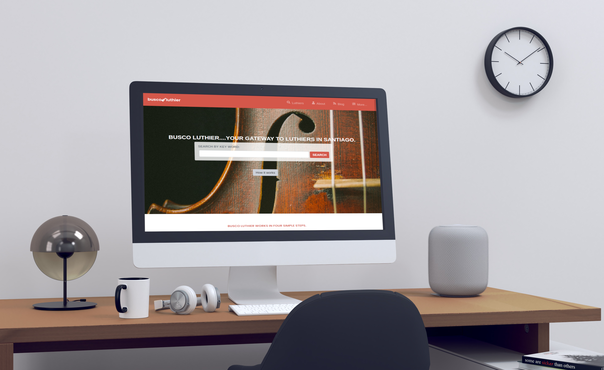
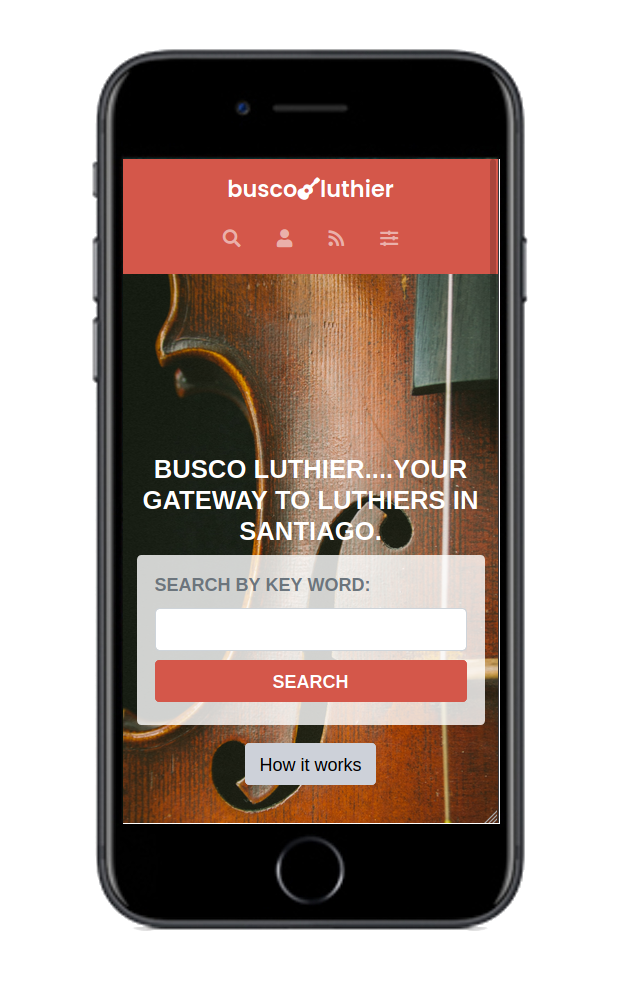

# Capstone project 1: HTML5 / CSS3 

## Busco Luthier: a directory of luthiers in Santiago, Chile

Capstone project at the end of the first module of Microverse.
This website is based on an online directory of schools, but with the personalised content of luthiers (a person who builds and repairs musical instruments). Using industry tools, I build a site that is composed of 3 pages: a homepage, a search results page and the luthier information page. The platform is fully responsive to all devices: mobile phones, tablets and large screens.

### Desktop version

### Mobile version

## Built with 

- HTML5
- CSS3
- Bootstrap
- SASS

## Live Demo

[Live Demo Link](https://aliciapaz.github.io/capstone-1/.)

## Usage

Check out the project on your prefered web browser with the provided Demo Link.

## Install

No installation required.

## Deployment

Deployed on GitHub pages for demonstration purposes.

## Author 

👤 **aliciapaz**

- GitHub: [@aliciapaz](https://github.com/aliciapaz)
- Twitter: [@_alicia_paz](https://twitter.com/_alicia_paz)
- LinkedIn: [LinkedIn](https://www.linkedin.com/in/alicia-rojas-71468418a/)

## 🤝 Contributing

Contributions, issues, and feature requests are welcome!

Feel free to check the [issues page](https://github.com/aliciapaz/capstone-1/issues).

## Show your support

Give a ⭐️ if you like this project!

## Acknowledgments

- Design idea by Mathew Njuguna and others on Behance

## 📝 License

This project is [MIT](./LICENSE) licensed.
